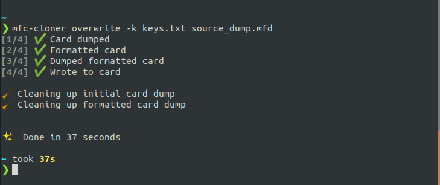

## What is mfc-cloner?

Mfc-cloner is a way to facilitate easy cloning of mifare classic cards.

It is a wrapper around libnfc and mfoc that streamlines the decrypting and writing process.

Mfc-cloner features include:

- Writing a source file to a blank card
- Overwriting a previously written card with another source file

## Requirements

Requires:
- [libnfc-1.7.1](https://github.com/nfc-tools/libnfc/releases/tag/libnfc-1.7.1) 
- [mfoc](https://github.com/nfc-tools/mfoc)

and a NFC contactless reader. I used a ACS NFC ACR122U RFID Contactless Smart IC Card Reader.


## Usage



### Installation 

```bash
cargo install mfc-cloner
```


### Write to a blank mifare classic card

```bash
mfc-cloner write-blank <card-uid> <source-file>
```


### Overwrite a mifare classic card

```bash
mfc-cloner overwite --key <-file> <source-file>
```
